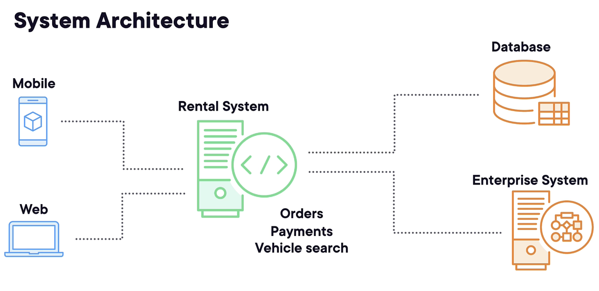
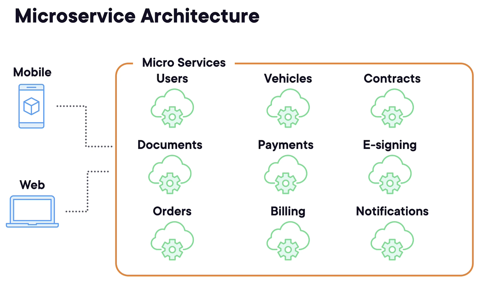
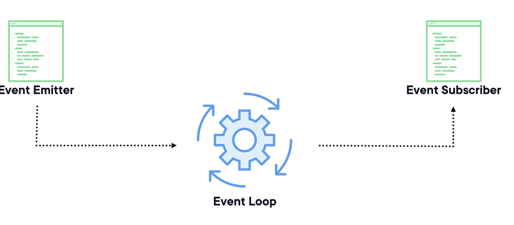

# This is a basic Node JS microservice

## Business Context

We are launching a new vehicle rental business where customers can hire cars and vans and manage all of this through a web application and a soon‑to‑be‑launched mobile application.
The application is going to allow users to search for vehicles, book vehicles, manage their payments, and so on.

In the past, an application like this might consist of only a few components. We'd have a mobile application or a website, and this is the entry point to the application and the part that the user interacts with.
This would typically send requests to a backend server that would handle everything from orders, payments, vehicle searches, and much more. This would be a single large application.

Sat behind this, we might have a database, perhaps SQL server, or maybe an enterprise system, such as SAP or Salesforce.



Now, we call this kind of architecture a monolith or monolithic application.
A monolithic application is a single, unified software system where all of its components and functions are tightly interwoven and managed in one codebase, running as one unit.
Initially, monolithic applications can be simpler to develop, especially for smaller applications.
But they do come with several disadvantages as the application grows and evolves.
Typically as the application grows, the codebase becomes more complex. This means it's harder to make changes and often leads to longer build and deployment cycles.
This can slow down the development process, especially in large teams.
Monoliths also become tightly bound to a specific technology stack. This makes it harder to integrate new technologies or update existing ones and often leads to significant rewriting or refactoring of the entire application.

They're also often quite unreliable. A bug or issue in one part of the system can potentially bring down the entire application, leading to large system outages. Over time as more developers contribute to the codebase and it naturally grows, the application can become a big ball of mud, a tangled, sprawling, and interwoven set of modules, making maintenance challenging.

This also makes the code harder to understand, especially for new developers joining a project.
This isn't to say that monolithic architectures are inherently bad.
They can be suitable for specific use cases, especially smaller, less complex applications.

However, as an application grows and requirements evolve, many organizations find that breaking the monolith into microservices can alleviate many of these challenges.

We will build this new application using microservices.

## Microservices Architecture

Let's reimagine the application now using microservices.

What would it look like? Well, we still have our mobile and web applications, but now instead of all of our code being tightly bound within a single application, we want lots of specialized services, often called **_domain services_**.

These services focus on only performing one task or only working with a certain type of data.

So we might have a user service for dealing with authentication or user registration, and a document service for handling document storage and retrieval.

Perhaps an order service for processing user purchase orders.

To support these, we might need other services, such as a vehicle service to provide us with vehicle information, along with other services such as payments and billing.

And so it goes on, lots of specialized services, little mini applications that do one thing and do it well. But what do these services look like?



Let's look now at the vehicle service, as this is the service that we're going to be building on this repo.

We typically interact with a microservice by making HTTP requests.
This is our API, or application programming interface. Just think of this as a set of HTTP methods that you can call to perform various actions.

For our vehicle service, we might want to get a vehicle, create a vehicle, update a vehicle, and delete a vehicle. We call these CRUD operations, and CRUD stands for create, read, update, and delete, and they're a common sight on almost all microservices.

In addition to this, we might want to search for a vehicle by registration number or perhaps by price. Our vehicle service exposes a set of functionality through its API, and we call these **_endpoints_**.

You can have as many or as few as you require. The only rule here is that they only deal with vehicles, nothing else.

Things get messy very quickly if you try and add operations that fall outside of its domain.

Behind each of these endpoints, we need to have some code.
That's our implementation, the logic of what's going to happen when our endpoint gets called.

We're implementing our microservice using Node.js and something called Express.js, which we'll look at later on.
But we could build the same service using .NET or indeed any other suitable technology.

If you remember back to our monolithic application, that had a massive single database that served the entire application.
But with microservices, we do things a little differently.
Each service typically has its own unique data store.
We're going to be using something called MongoDB, which is a noSQL database and perfect for our scenario.
Different services, however, may have different requirements, so a document service might use blob storage instead, or perhaps a combination of different data stores.

## Requirements

Node 20, run in MMode 20, you can use nvm to install this, and try newer versions of Node.js, but this is built using Node 20.

## How this project is architected

The entry point for our application is a file called app.js or index.js.

It initializes the server and often includes the main application logic. In a simple application, this file might set up an HTTP server, listen on a port, and define roots or endpoints.

We then have the **_package.json_** file.
This file is the heart of your Node.js application and includes metadata about your project, as well as managing the project's dependencies, scripts, and versions.
It contains details such as the project name, version, and entry point, as well as scripts for starting and testing the application, and a list of dependencies and dev dependencies.

We then have the node_modules folder. This folder contains all the NPM packages, which are the library's independences that are installed for your project. This folder is autogenerated when you install dependencies and is typically not included in version control.

Now depending on the complexity of your application, we might have other files, such as model files and services.

While the aim of this project is to understand how to build microservices with Node.js, it's important that you have a good grasp of several fundamental JavaScript concepts, as Node.js is built on JavaScript.

### asynchronous JavaScript

Including callbacks, promises, and async await.
This is an important concept when building microservices with Node.js, as it allows your service to handle I/O operations without blocking, which enhances performance and scalability.

### error handling

Proper error handling is crucial, especially in a distributed environment like microservices.
The way we achieve this in JavaScript is by using the try/catch block.
If we have code that could or is likely to raise an exception, we need to wrap this code in a try catch statement.
You write the code that may produce an error inside the try block. If an error occurs, the execution of this block is stopped and the control is passed back to the catch block. The code inside the catch block is executed if an error occurs in the try block. The error object can be accessed within this block.
We can also use the finally block alongside try catch. Code inside the finally block will run regardless of whether an error occurred. And this is a useful way for cleaning up resources or other finalizing tasks, like closing database connections or other no longer needed resources.
You can also raise your own errors using the throw statement.

```javascript
function processNumber(number) {
  try {
    if (number < 0) {
      throw new Error("Negative numbers are not allowed");
    }
    // Process the number
  } catch (error) {
    console.error("Error occurred:", error.message);
  } finally {
    console.log("Cleanup actions can be performed here");
  }
}
```

### Event Driven Programming

Event‑driven programming is a core aspect of Node.js, allowing it to handle concurrent operations efficiently.

It's a programming paradigm where the flow of the program is determined by events, such as user actions, I/O operations, or timers.

In Node.js, this model is widely used due to its non‑blocking asynchronous nature.

Essentially, it allows you to create events within your code that other parts of your system can respond to, and this basically follows a publish subscribe model (pub/sub).

We can use something called the Event Emitter to publish and subscribe to events that occur in our own code, as well as any other modules that we may be using.

**_The published events are picked up by something called the Event Loop. _**

That's really the beating heart of Node.js. It's continuously checking for events and dispatches them to their respective subscribers when they occur.



Example

To get started, we need to import the events module and create a new class that extends the EventEmitter class.
Then we simply create a new instance of our class and register an event listener using the on function.
This one's simply called log and writes a message to the console.

This is the code that's going to get executed when the event is triggered.

Finally, we're emitting a log event using emit.
When the log event is emitted, the associated listener function is called, logging the provided message to the console.

```javascript
const EventEmitter = require("events");

class MyEmitter extends EventEmitter {}

const myEmitter = new MyEmitter();

// Register an event listener for the 'log' event
myEmitter.on("log", (message) => {
  console.log("Log event received:", message);
});

// Emit the 'log' event with a message
myEmitter.emit("log", "Hello, world!");
```

Event‑driven programming in Node.js is particularly powerful for building scalable network applications. It efficiently handles asynchronous operations and allows developers to structure their applications in a way that responds to a multitude of different events.

Autoscroll
